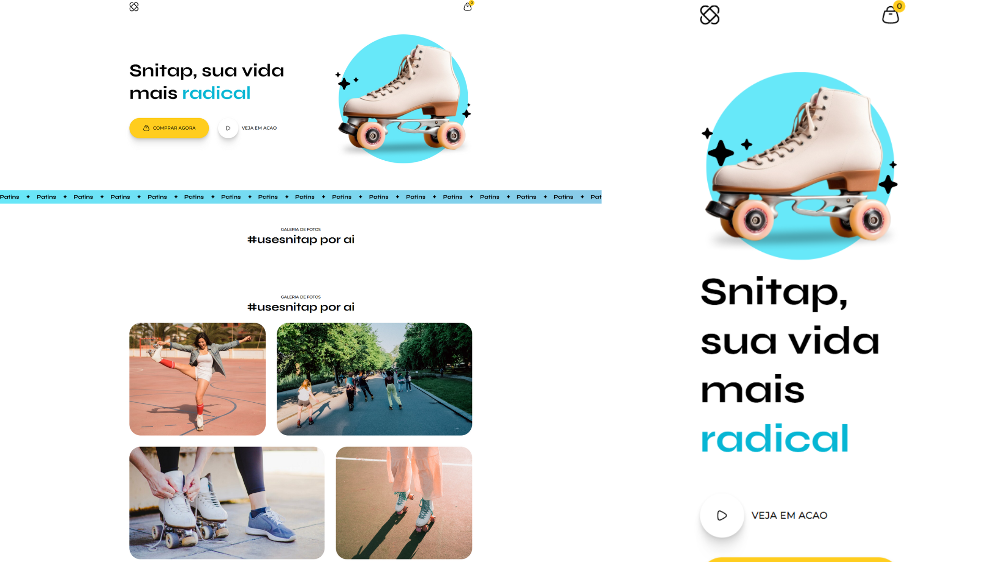

# Snitap Patins 🌟

This is a simple project I created to practice **HTML** and **CSS animations**. It demonstrates different animation techniques like keyframes, transitions, and hover effects.

## 🚀 Features
- Smooth animations with `@keyframes`.
- Hover effects for interactivity.
- Fully responsive design.
- Simple and clean layout.

## 📸 Preview
](https://wesjx.github.io/Snitap-Patins/)
Click on the image to acess the website

## 💻 Technologies Used
- **HTML5**: For the structure of the web page.
- **CSS3**: For styling and animations.

🙌 Learnings
This project helped me improve my understanding of:

CSS animations and how to use @keyframes.
Responsive design principles.
Structuring small projects effectively.
